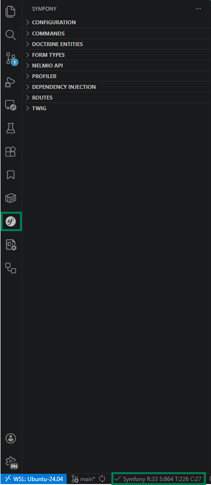
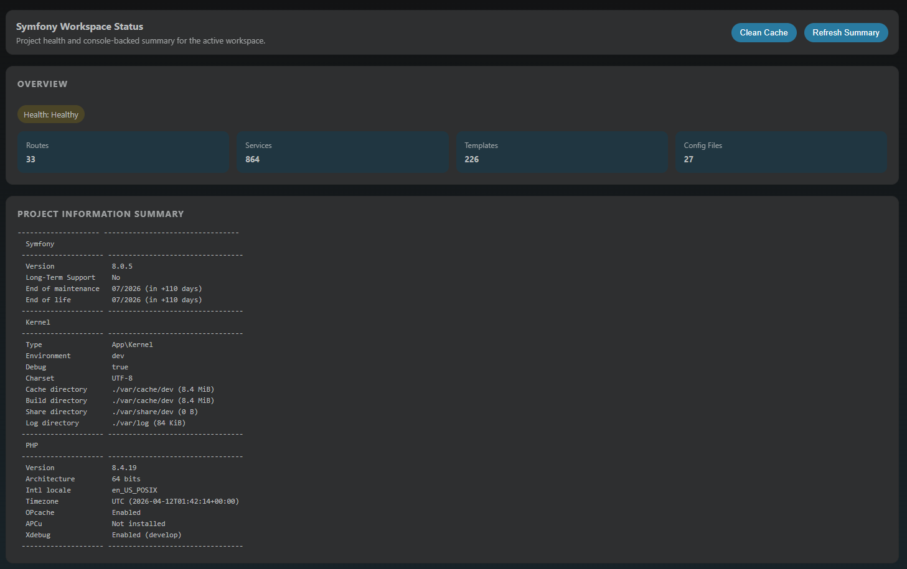
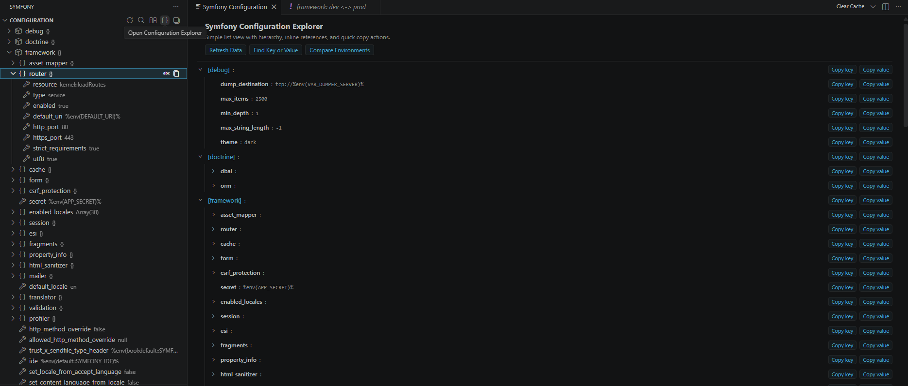
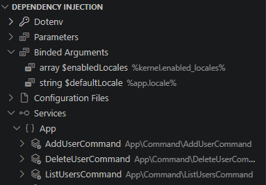
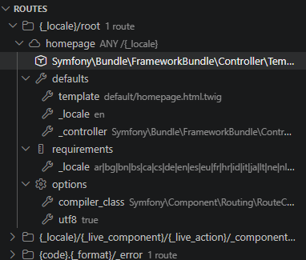
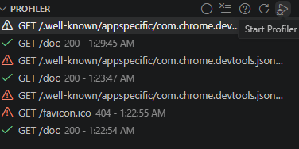

This guide covers the workspace exploration workflows available in SymfonyKD.

## Sidebar and workspace indicator

The sidebar is the primary place to inspect project data and Symfony subsystems.

From the workspace indicator, open the workspace summary to inspect high-level project information.

## Configuration workflows

Use the configuration section when you need fast inspection and comparison of Symfony settings.

Available workflows include:

- Refresh data
- Search in the sidebar tree
- Compare environments with Envs Diff
- Open the full configuration explorer
- Copy keys and values
- Navigate to service definitions

## Dependency Injection workflows

Inspect Symfony dependency injection details in one place.

Use this view for:

- Environment variable values
- App parameters
- Configuration files
- Bound arguments with navigation to definitions
- Full service list with navigation support

## Routes workflows

Review route names, metadata, and controller references.

Use route navigation to jump quickly into controller code while reviewing endpoint behavior.

## Profiler workflows

Profiler support helps you inspect captured entries from inside VS Code.

Main actions:

- Start capture (manually or with debugger automation)
- Reload data
- Clear history
- Open setup help
- Open profiler pages directly from captured entries

Next: [Run console commands](/guides/run-console-commands/)
