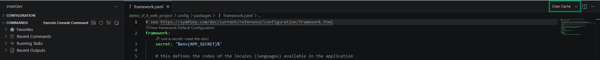

SymfonyKD provides command workflows designed for fast iteration without leaving the editor.

## Execute commands

Open command palette and run `Symfonykd: Execute Console Command`.

The command flow is quick-pick driven and writes output to a dedicated channel for stdout and stderr.

## Use command history and favorites

Console support includes:

- Command history
- Favorite commands
- Recent command reruns
- Running task output access
- Recent outputs access

These workflows reduce repetitive setup for frequent console tasks.

## Compare command output

Use comparison actions when validating environment changes, configuration differences, or behavior changes between command runs.

## Clear and reset state

If command history becomes noisy, clear history from the command actions and continue with a clean list.

## Related guides

- [Explore Symfony workspace](/guides/explore-symfony-workspace/)
- [Use @symfony chat participant](/guides/use-chat-participant/)
