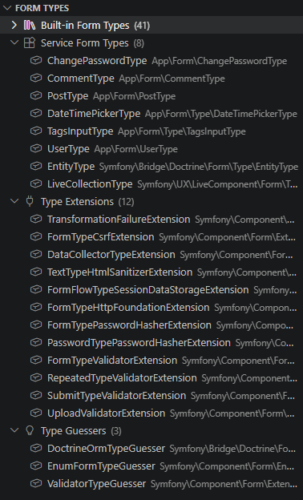
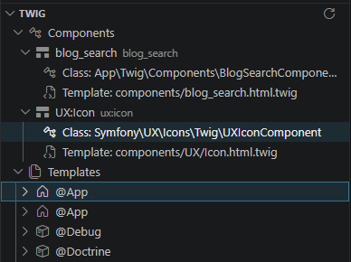
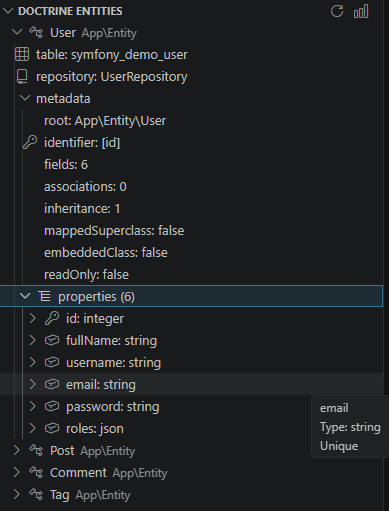
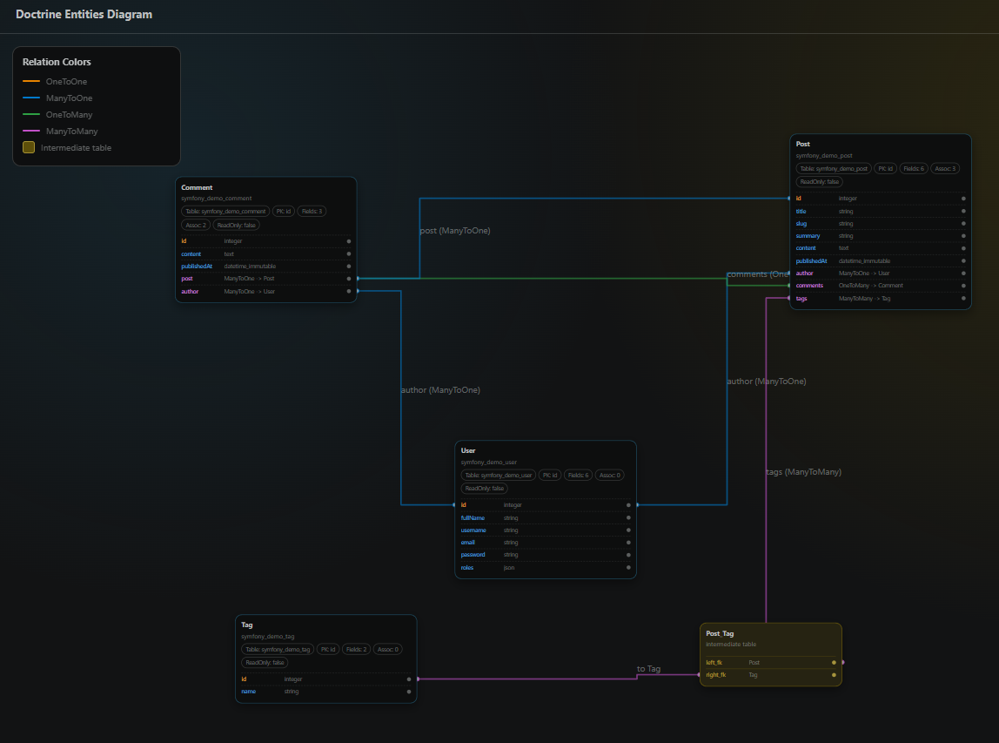

This page lists SymfonyKD sidebar capabilities by feature area.

## Workspace view

The workspace indicator opens a workspace summary with core project information.

## Configuration

Actions:

- Refresh
- Search in sidebar tree
- Envs Diff for comparing two environments
- Full configuration explorer

Tree support:

- Copy keys and values
- Navigate to service definitions

## Console commands

Capabilities:

- History support
- Quick commands in editor workflow
- Execute command via command palette
- Compare command output
- Clear history
- Favorite commands
- Recent command reruns
- Running task output access
- Recent outputs access

## Dependency Injection

Capabilities:

- Environment variable values tree
- App parameters list
- Configuration files list
- Bound arguments with definition navigation
- Services list with definition navigation

## Routes

Capabilities:

- Route listing with related metadata
- Navigation to controller references

## Profiler

Actions:

- Clear history
- Help for profiler setup and CORS guidance
- Reload
- Start capture

Additional behavior:

- Optional debugger integration with `symfonykd.profiler.autoStartWithDebugger`
- Captured entries open profiler pages in VS Code

## Symfony extended support

### Forms

- Built-in form types from installed libraries
- Service form types with navigation
- Type extensions with navigation
- Type guessers with navigation

### Twig

- Components list with class navigation
- Template lists grouped by bundles

### Doctrine

- Entity tree with metadata and fields
- Diagram action for visual entity relationships

Next: [Language server capabilities](/reference/language-server/)
